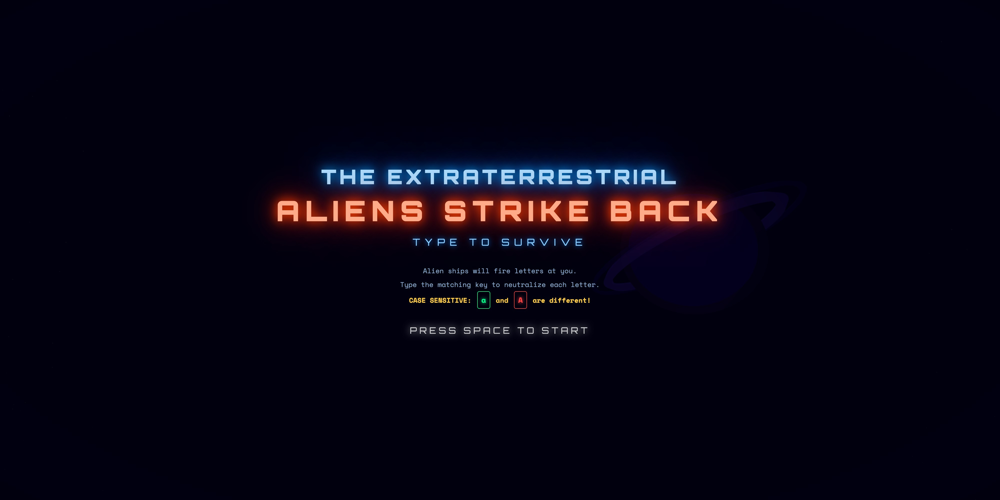

# Typing Game

[](https://typing-game.gallop.software)

A best-in-class TypeScript starter for shipping high-quality 3D browser games — built on React, React Three Fiber, and Three.js — so you can build at the speed of thought with AI, ship a polished game, and rank #1 on Google.

**⚡ Demo:** [typing-game.gallop.software](https://typing-game.gallop.software)
**☁️ Cloudflare Demo:** [typing-game-cloudflare.gallop.software](https://typing-game-cloudflare.gallop.software)
**🎨 Template:** [gallop.software/templates](https://gallop.software/templates)
**📦 Repository:** [github.com/gallop-software/typing-game](https://github.com/gallop-software/typing-game)
**🏷️ Category:** 3D Typing Game

---

## Why Use Gallop Templates?

Just chat with AI inside our Gallop AI Editor using Gallop templates, and you will never want to wrestle with a heavyweight game framework or a bloated visual editor again. Simply describe the game you want, and AI writes the code. No Unity, no GameMaker, no level editors, and no design limitations. Just type and watch. Build fun and crisp gameplay, add smooth animations, configure your SEO and AI discoverability instantly, expand endlessly, and get prompting tips from our [Gallop community](https://discord.gg/jJw8xrhFj). Go live in minutes.

[](https://gallop.software/#learn-more)

---

## Features

- 🚀 **React Three Fiber** — declarative Three.js rendering as React components
- 🌌 **Three.js** WebGL renderer with starfields, particle effects, and dynamic lighting
- 🎁 **@react-three/drei** helpers — `Stars`, `Text`, and more out of the box
- ⌨️ **Typing gameplay** — destroy incoming alien ships by typing the letters they carry
- 🎯 **Responsive canvas** that adapts to any viewport, including live window resize
- 🧩 **Clean architecture** — game logic and UI cleanly separated
- 🤖 **AI-friendly** codebase structure with TypeScript strict mode
- ⚡ **Vite** for instant hot reload and lightning-fast production builds
- 🛡️ **Type-safe** end-to-end with `strict: true`
- ☁️ **Cloudflare Workers ready** — one command from local build to live URL
- 🎮 **Playable game** included so the project runs out of the box

---

## Getting Started

New to this? No problem. You'll have AI guiding you the entire way.

### The Gallop AI Editor

The [Gallop AI Editor](https://gallop.software/) is a desktop app built specifically for AI-powered web development. It includes everything you need — code editor, AI assistant, Git, terminal, media manager, font manager, SEO & structured data scanner, and a gallery of open-source templates — all in one window with nothing to configure.

It was purpose-built for this workflow, whether you're a complete beginner or an advanced game developer who wants AI-assisted iteration:

|                      | What you get                                                                                       |
| -------------------- | -------------------------------------------------------------------------------------------------- |
| **Best for**         | Non-programmers, junior programmers, advanced programmers                                          |
| **AI built in**      | Claude ready to go — use Gallop AI with no setup, your Claude Max or Pro plan, or your own API key |
| **Template gallery** | Built in, and every template is free and open source                                               |
| **Media manager**    | Built-in Studio with CDN sync                                                                      |
| **Font manager**     | Built-in Studio with WOFF2 font generation                                                         |
| **SEO Audit**        | Analyze SEO & Structured Data                                                                      |
| **Git**              | Git UI with modal diff viewer                                                                      |
| **Node.js**          | Built-in installer and version manager                                                             |
| **Deployment**       | Connect Cloudflare, then let AI deploy for you                                                     |

[](https://gallop.software/)

Available for Mac and Windows.

#### Step 1: Install Gallop AI Editor

1. Go to [gallop.software](https://gallop.software/) and download the installer for your platform
2. Open the installer and follow the prompts
3. Launch the Gallop AI Editor
4. If prompted, the editor will walk you through installing Node.js automatically — just follow the on-screen steps

#### Step 2: Create Your Project

Open the **New Project** modal. It has three tabs — **Gallop Templates**, **Git Repositories**, and **Local** — and you want the first one.

1. On the **Gallop Templates** tab, select **Typing Game** from the gallery
2. Name your new repository, and pick which GitHub account or organization owns it
3. Choose whether it's public or private
4. Pick the folder on your computer where it should live
5. Click create

The editor then does everything else in one pass:

- **Creates your own repository on GitHub** from the template — a clean repo that belongs to you, with no shared history tying it back to the original
- **Clones it to your machine** in the folder you picked, with a progress bar
- **Opens it as a project**, ready to run

Because the repository is created here, **your GitHub repo already exists** by the time you reach [Put Your Game Online](#put-your-game-online) — there's nothing to set up on GitHub when it's time to deploy.

> **Why this is one click:** you're already signed in to GitHub inside the editor, so it can create the repository on your behalf without asking you for anything.

#### Step 3: Start Your Game

Click the **play icon** in the left rail (or press `Cmd+1`) to open the **Start Website** view. It's a terminal with a toolbar across the top — two clicks and your game is running locally.

1. Click **Install** and wait for it to finish. This downloads everything the project needs, and takes a minute or two the first time.
2. Click **Start Website**. Your game is now running at [http://localhost:5173](http://localhost:5173).
3. Click the **globe icon** in the top-right title bar to open it in a browser. Hover it and it tells you the port it's running on.

Here's the full toolbar, and the command each button saves you from typing:

| Button                      | What it does                                                                              | Equivalent command                   |
| --------------------------- | ----------------------------------------------------------------------------------------- | ------------------------------------ |
| **Install** / **Reinstall** | Downloads the project's dependencies. Reads **Reinstall** once they're already installed. | `npm install`                        |
| **Start Website**           | Starts the Vite dev server with hot reload — save a file and the browser updates itself.   | `npm run dev`                        |
| **Stop**                    | Shuts the server down and frees up the port. Replaces **Start Website** while running.    | `Ctrl+C`                             |
| **Refresh Cache**           | Clears the dev-server cache and restarts. Only appears while running.                     | delete `node_modules/.vite`, restart |
| **Clear**                   | Wipes the terminal output. Doesn't touch the server.                                      | `clear`                              |

The play icon in the left rail turns **green with a dot** while your game is running, so you can tell at a glance from any view.

**Leave the server running while you work.** You only need **Start Website** once per session — the game reloads on its own every time you or the AI saves a file.

**If something looks stuck** — a change won't appear, or the page won't load — try **Refresh Cache** first, and **Stop** then **Start Website** if that doesn't do it.

#### Step 4: Chat with AI

Press `Cmd+J` to show the AI panel on the right. Click the **+** in its header and you'll get a picker with three cards:

| Card            | What it is                                                                                                      |
| --------------- | ----------------------------------------------------------------------------------------------------------------- |
| **AI Chat**     | Gallop's own chat interface — message bubbles, plan mode, and the target for screenshots you insert. Start here. |
| **Claude Code** | Claude Code itself, running as a terminal inside the panel.                                                     |
| **Terminal**    | A plain shell, for when you want to run something yourself.                                                     |

**Both AI options are Claude Code.** Gallop's AI Chat runs Claude Code under the hood and puts a friendlier interface on top of it; the Claude Code card gives you the same engine as its normal terminal interface. Same capabilities, same access to your project — pick whichever you find easier to read.

- **New to this?** Use **AI Chat**. Answers render as formatted text, file changes are easier to follow, and screenshots insert straight into the conversation.
- **Already use Claude Code?** Use the **Claude Code** card. Everything works the way you're used to, including slash commands and your existing habits.

You can run both at once in separate tabs — they're independent sessions.

Pick **AI Chat**, then just ask:

```
I'm new to this. Help me turn this template into my own 3D game.
```

The AI assistant can read and edit your project files, run commands, and explain anything you're confused about. Just describe what you want in plain English:

```
Add a boss wave that spawns after every 100 points
```

```
Make destroyed ships drop power-ups I can catch by typing
```

```
Add a combo multiplier for consecutive correct letters
```

```
Wire up a persistent high-score table on the game-over screen
```

**Tip:** Press `Cmd+Shift+S` to take a screenshot of your running game and attach it to the chat. The AI can see exactly what you see and suggest changes visually.

---

## Working in the Editor

Everything below is how you actually build your game day to day. The left rail switches between views; each has a keyboard shortcut.

| Icon | View               | Shortcut | What it's for                                                                                                                 |
| ---- | ------------------ | -------- | ----------------------------------------------------------------------------------------------------------------------------- |
| ▶    | **Start Website**  | `Cmd+1`  | Run your game locally. Install, Start, Stop, Refresh Cache — see [Step 3](#step-3-start-your-game). Turns green while running. |
| ⑂    | **Source Control** | `Cmd+2`  | Commit, branch, and merge visually. The badge shows how many files changed.                                                    |
| `<>` | **Editor**         | `Cmd+3`  | The code editor, with autocomplete and go-to-definition. `Cmd+B` toggles the file explorer.                                    |
| 🖼   | **Studio**         | `Cmd+4`  | Your images and fonts — see below.                                                                                            |
| 🌐   | **SEO**            | `Cmd+5`  | Scan any page for SEO and structured-data problems.                                                                           |
| 🚀   | **Publish**        | `Cmd+6`  | Connect Cloudflare so AI can deploy for you.                                                                                  |

`Cmd+K` cycles forward through views if you'd rather not remember numbers.

### The AI Panel

The AI panel lives on the right and is where most of your work happens.

- `Cmd+J` shows and hides it. Hiding does **not** stop what's running — a long AI task keeps going while the panel is closed.
- `Cmd+I` expands it to fill the window, for when you're reading a long answer.
- `Cmd+T` opens a new tab; `Cmd+Shift+[` and `Cmd+Shift+]` cycle between them. You can drag tabs to reorder them.
- Every tab has a `×`. Close the last one and you're back at the AI Chat / Claude Code / Terminal picker.

**Agent mode vs Plan mode** — on an AI Chat tab, press `Cmd+.` to switch between them. (Claude Code tabs have their own mode controls, so `Cmd+.` doesn't apply there.)

| Mode      | Behavior                                                   | Use it when                                            |
| --------- | ------------------------------------------------------------ | ------------------------------------------------------ |
| **Agent** | AI edits your files directly.                              | You trust the change — most of the time.               |
| **Plan**  | AI describes what it intends to do and waits for approval. | The change is large or you want to learn what it does. |

Two AI Chat slash commands are worth knowing: `/new` starts a fresh conversation, and `/compact` summarizes a long one so you can keep going without losing the thread.

**How you pay for AI** is set in the panel's settings gear. There are three options, and none of them require you to have an API key:

| Option           | What it uses                             | Good for                                               |
| ---------------- | ---------------------------------------- | ------------------------------------------------------ |
| **Gallop AI**    | Our proxy, billed from a prepaid balance | Getting started — nothing to sign up for or configure  |
| **Subscription** | Your existing **Claude Max or Pro** plan | You already pay Anthropic monthly and want to use that |
| **Your API Key** | Your own Anthropic API key               | You'd rather be billed by Anthropic per request        |

Sessions pick up this setting when they start, so change it _before_ opening a chat tab.

### Showing AI What You See

Describing a visual bug in a 3D scene is hard. Show it instead.

- `Cmd+Shift+S` — drag a box around any part of your running game. The capture opens in an annotator where you can draw arrows and boxes, then **Insert** it straight into a chat tab.
- `Cmd+Shift+G` — opens the code file behind whatever page your browser is showing.
- `Cmd+Shift+L` — drops the file you're editing into the chat as a reference, so you can say "fix the spacing here" without explaining where "here" is.

### Studio: Images and Fonts

`Cmd+4` opens Studio, which manages everything in your `public/` folder.

- Drop in sprites, textures, and icons and it generates thumbnails automatically
- Crop and edit without leaving the editor
- Push assets to a CDN so they load fast worldwide
- Drop in a font and it converts to WOFF2, the format browsers load fastest

### SEO

`Cmd+5` opens the SEO view. You run a report yourself — the AI can't trigger one for you:

1. Type or paste the URL you want to check (your local game works: `http://localhost:5173`)
2. Pick a report from the dropdown
3. Click **Analyze**

| Report                      | What it tells you                                                                                                                  |
| --------------------------- | ---------------------------------------------------------------------------------------------------------------------------------- |
| **Analyze On-Page SEO**     | Titles and descriptions, each rated from "Missing" through "Too long" so you can see what to tighten                                |
| **HTML vs DOM**             | What search engines receive versus what loads in the browser — critical for a canvas game, whose gameplay is invisible to crawlers |
| **Analyze Structured Data** | Whether the JSON-LD `VideoGame` block that search engines and AI assistants read is valid                                          |

Each report opens in its own tab, so you can check several pages side by side.

Once you have the results, hand them to AI: screenshot the report with `Cmd+Shift+S` and insert it into a chat, or paste the details in. Then ask for what you want:

```
Here's the SEO report for my game. Fix everything it flags.
```

### Source Control

`Cmd+2` gives you Git without the command line — stage individual lines, review diffs side by side, and browse history. If you'd rather not think about Git at all, don't: ask AI to "commit my changes and push them."

### Keyboard Shortcuts

| Shortcut            | Action                                      |
| ------------------- | ------------------------------------------- |
| `Cmd+1`–`Cmd+6`     | Switch views                                |
| `Cmd+K`             | Cycle views forward                         |
| `Cmd+J`             | Show/hide the AI panel                      |
| `Cmd+I`             | Expand/collapse the AI panel                |
| `Cmd+.`             | Toggle agent ↔ plan mode                    |
| `Cmd+T`             | New tab                                     |
| `Cmd+W`             | Close tab                                   |
| `Cmd+Shift+[` / `]` | Cycle tabs                                  |
| `Cmd+B`             | Toggle file explorer                        |
| `Cmd+P`             | Quick Open — jump to any file by name       |
| `Cmd+F`             | Find                                        |
| `Cmd+Shift+F`       | Find in all files                           |
| `Cmd+S`             | Save                                        |
| `Cmd+Shift+S`       | Screenshot                                  |
| `Cmd+Shift+G`       | Open the route file for your browser's page |
| `Cmd+Shift+L`       | Send the current file to chat               |
| `Cmd+Shift+N`       | New window                                  |

On Windows, use `Ctrl` wherever this says `Cmd`.

---

### Join the Community

Connect with other Gallop users on Discord or Slack. Share your progress, swap AI prompting tips, and see what indie devs are shipping with the help of AI.

[](https://discord.gg/jJw8xrhFj)
[](https://gallop-software.slack.com/)

---

## How to Play

Alien ships descend from space, each carrying a letter. Type the matching letter to fire a laser and blow it up before it reaches the planet's surface. Clear waves, chase your high score, and watch out for the UFO letter-bursts. All keyboard, all reflexes.

---

## Put Your Game Online

Your code is already on GitHub — you're signed in inside the editor, and your repository was created when you started the project. All that's left is a hosting account: [Cloudflare](https://www.cloudflare.com/plans/developer-platform/). Check their current plans before you commit — pricing and what each tier allows change over time.

### The Easy Way: Let AI Deploy It

Press `Cmd+6` (the rocket icon) to open the **Publish** view and pick the **Cloudflare** tab. It links straight to the page where you generate the token, with the right permissions preselected — you paste it in, click **Connect** to verify it, then **Save**.

From then on the editor injects those credentials into your terminal and AI chat automatically, so the assistant can deploy on your behalf and **you never paste a token into a project file**.

> **Important:** credentials are handed to a session when it starts. After saving a new token, open a **new** chat or terminal tab — an existing one won't see it.

Then just ask:

```
Push my latest changes to GitHub and deploy this game
```

The AI will walk you through every step. When you're done, your game will be live with a URL you can share.

### Deploy to Cloudflare Workers

Typing Game builds to plain static files, which Cloudflare Workers serves directly through its [static assets](https://developers.cloudflare.com/workers/static-assets/) support — no adapter, no server runtime, no environment variables to manage. See it live: **[typing-game-cloudflare.gallop.software](https://typing-game-cloudflare.gallop.software)** — the same template, deployed exactly the way this section describes.

**Step 1 — Connect Cloudflare in the Publish view** (`Cmd+6`). Once saved, the editor puts your Cloudflare credentials (`CLOUDFLARE_API_TOKEN` and `CLOUDFLARE_ACCOUNT_ID`) into the terminal environment and makes them available to the AI chat. Wrangler reads those variables automatically, which means **nobody has to run `npx wrangler login`, and no token is ever pasted into a file.**

**Step 2 — Paste this prompt into the AI chat:**

```
Deploy this game to Cloudflare Workers. My Cloudflare account is already
connected, so CLOUDFLARE_API_TOKEN and CLOUDFLARE_ACCOUNT_ID are in the
terminal environment — do not run `wrangler login`.

Please:
1. Ask me what to name the Worker, then set that name in wrangler.jsonc
2. Run `npm run cf:deploy` to build and create the Worker
3. Tell me the live URL when it's done
```

First deploy takes a couple of minutes; everything after that is seconds.

**Step 3 — Follow-up prompts** for anything after the first deploy:

```
Deploy my latest changes to Cloudflare
```

```
Rename my Cloudflare Worker to my-typing-game and redeploy
```

```
Run the Cloudflare preview locally so I can test the production build
```

**If a prompt fails,** paste the error back into the chat. The most common cause is a Cloudflare account that isn't connected yet, so wrangler has no credentials — the AI can diagnose that from the error text.

Congratulations! Your game is now live to the world. Share your new URL and start growing your audience. Ready for a custom domain? Add it under the Worker's **Settings → Domains & Routes**, or see [Cloudflare's custom domain guide](https://developers.cloudflare.com/workers/configuration/routing/custom-domains/).

#### Reference: How the Cloudflare Deployment Works

Everything below is **reference material for your AI assistant** — what files Cloudflare needs, which ones get created, and what has to change when you rename things. You don't need to read or run any of it yourself; the prompts above cover the whole process. It's here so the AI has accurate ground truth, and so you have something to point at if a deploy goes wrong.

##### The Files Involved

Typing Game ships Cloudflare-ready. **If you forked or generated this repo, every config file already exists — you do not create any of them.**

| File             | What it does for Cloudflare                                                                                                          |
| ---------------- | ------------------------------------------------------------------------------------------------------------------------------------ |
| `wrangler.jsonc` | The Worker manifest. Names the Worker and points at `dist/`, the folder `npm run build` produces. Wrangler reads it on every command. |
| `package.json`   | Holds the `cf:*` scripts plus `wrangler` as a devDependency.                                                                          |

Generated paths — `dist/` (the build output) and `.wrangler/` (wrangler's local state) — are already gitignored. `dist/` does not exist until you build, which is why `cf:deploy` and `cf:preview` always build first.

##### The Deployment Sequence

This is what the AI runs on your behalf:

```bash
npm run cf:deploy    # build + deploy — creates the Worker on first run
```

No `wrangler login` step is needed: connecting Cloudflare in the editor already put `CLOUDFLARE_API_TOKEN` in the environment, and wrangler picks it up automatically. If your account can't be inferred from the token, `CLOUDFLARE_ACCOUNT_ID` covers it — the editor sets that too. Wrangler ships as a dev dependency, so `npx` runs the local copy and there is nothing to install globally.

Because this is a purely static build, there are no secrets to push and no runtime environment to configure. Deploying is the whole story.

##### Renaming the Worker

`wrangler.jsonc` ships with the Worker named `typing-game`. Change the `name` field to rename it — that value must equal the Worker's actual name in your Cloudflare dashboard, or a later deploy will create a second Worker instead of updating the first.

##### Client-Side Routing

`wrangler.jsonc` sets `"not_found_handling": "single-page-application"`, so any URL that doesn't match a built file serves `index.html`. That's what keeps deep links working if you add client-side routes later. Leave it in place unless you intentionally want 404s.

##### Git-Connected Builds

If you connect the repo in the Cloudflare dashboard instead of deploying from your machine:

- **Build command:** `npm run build`
- **Deploy command:** `npx wrangler deploy`

Custom domains live under the Worker's **Settings → Domains & Routes**.

##### Quick Reference

| Command              | What it does                                                                   |
| -------------------- | ------------------------------------------------------------------------------ |
| `npm run cf:build`   | Type-check and bundle to `dist/`                                               |
| `npm run cf:preview` | Build and run the real Workers runtime locally                                 |
| `npm run cf:deploy`  | Build and deploy to Cloudflare                                                 |
| `npm run cf:upload`  | Build and upload a new Worker version without making it live (staged rollouts) |

---

## About Gallop Templates

Typing Game is part of the [Gallop](https://gallop.software) template ecosystem. Gallop templates are designed to be built with AI — just describe what you want in plain English and watch your project come to life.

### Gallop AI Editor

The [Gallop AI Editor](https://gallop.software/) is a desktop code editor built specifically for AI-powered development. It combines a full code editor, Claude AI assistant, visual Git interface, integrated terminal, media manager, and template gallery into one app. Everything is preconfigured to work with Gallop templates out of the box — no extensions, no plugins, no setup.

**Key highlights:**

- **Claude built in** — Chat with Claude to write gameplay, debug rendering, and learn engine APIs as you go
- **Agent and Plan modes** — Agent mode lets AI apply changes automatically. Plan mode shows you what AI wants to do before it does it, so you stay in control
- **Screenshot capture** — Press `Cmd+Shift+S` to screenshot your running game and share it with AI for visual feedback
- **Built-in template gallery** — Browse and clone Gallop templates without leaving the editor; every one is free and open source
- **Visual Git** — Stage, commit, and merge with a visual interface. No command line required
- **Studio media manager** — Manage sprites, audio, and assets with thumbnail previews and CDN sync
- **One-click deployment** — Connect Cloudflare and let AI ship your game
- **Node.js manager** — Install and switch Node.js versions without touching the terminal
- **Auto-updates** — The editor keeps itself up to date automatically

### Built for SEO and AI Discoverability

This template is built to get your game ranked #1 on Google and recommended by AI assistants like ChatGPT and Google's Gemini. Canvas-rendered games are invisible to crawlers by default, so the HTML shell is the place to add semantic landmarks, complete metadata, Open Graph, Twitter cards, and a JSON-LD `VideoGame` schema block that search engines and AI models actually parse.

AI mentions are becoming more important than traditional SEO. When someone asks an AI assistant for "fun browser games like X," you want yours in that answer. Gallop templates are built with the structured data and semantic markup that AI models rely on to understand and recommend your work.

### What You Can Build

- **Build games with AI** — Let AI do the technical heavy lifting while you provide creative direction
- **Skip the boring work** — Let AI scaffold scenes, wire up input, generate placeholder art, and handle 3D setup
- **Crisp 3D rendering** — Three.js via React Three Fiber renders sharp on Retina and 4K displays
- **Declarative scene graph** — Describe your 3D world as React components; state and rendering stay in sync
- **Get found online** — Battle-tested SEO foundation with structured data for search engines and AI assistants
- **Deploy instantly** — Static-build output that drops onto Cloudflare Workers in a single command

### Built by Industry Veterans

The [team](https://webplant.media) behind Gallop has decades of combined experience building websites, apps, and web applications for top global brands. We've helped projects achieve #1 Google rankings in competitive markets and understand what it takes to ship something polished. That expertise is baked into every template, every component and every line of code.

---

## Project Structure

```
typing-game/
├── src/
│   ├── main.tsx               # React entry: mounts <App /> into #root
│   ├── App.tsx                # Full game: R3F canvas, entities, input, phases
│   ├── index.css              # Global styles
│   └── ui/
│       └── ui.css             # HUD / menu / game-over overlay styles
├── public/
│   ├── favicon.svg            # Vector favicon
│   └── icons.svg              # UI icon sprite sheet
├── index.html                 # HTML shell + <div id="root">
├── vite.config.ts             # Vite configuration
├── wrangler.jsonc             # Cloudflare Worker manifest
├── tsconfig.json              # TypeScript project references
├── tsconfig.app.json          # App TypeScript config (strict: true)
├── tsconfig.node.json         # Tooling TypeScript config
├── eslint.config.js           # ESLint flat config
├── knip.json                  # Unused-code detection config
├── package.json
└── README.md
```

---

## Available Scripts

### Development

- **`npm run dev`** — Start development server at http://localhost:5173 with hot reload
- **`npm run build`** — Type-check, then bundle to `dist/` for production
- **`npm run preview`** — Serve the production build locally for testing
- **`npm run lint`** — Run ESLint on all source files

### Cloudflare Deployment

Your AI assistant runs these for you — see [Deploy to Cloudflare Workers](#deploy-to-cloudflare-workers).

- **`npm run cf:build`** — Type-check and bundle to `dist/`
- **`npm run cf:preview`** — Build and run the real Workers runtime locally
- **`npm run cf:deploy`** — Build and deploy to Cloudflare
- **`npm run cf:upload`** — Build and upload a new version without making it live

---

## Technologies

### Frontend (Runtime)

The libraries that power the game at runtime — each one lightweight, widely adopted, and well-suited to real-time 3D in the browser.

- **React** `19` — Component model and state management
- **Three.js** `0.183` — WebGL 3D renderer
- **@react-three/fiber** `9` — React renderer for Three.js
- **@react-three/drei** `10` — Helpers and abstractions for R3F (`Stars`, `Text`, …)

### Build & Tooling

Everything used to develop, type-check, and bundle the project:

- **Vite** `8` — Dev server and bundler with instant HMR
- **TypeScript** `5.9` — Type safety and IntelliSense (`strict: true`)
- **ESLint** `9` — Code linting (with `typescript-eslint`)
- **Prettier** `3` — Code formatting (with `prettier-plugin-organize-imports`)
- **Knip** `6` — Unused files, dependencies, and exports detection

### Deployment

The tooling that takes the build output live:

- **Wrangler** `4` — Cloudflare CLI that builds, previews, and deploys the Worker

---

## Support & Community

- **Documentation:** [gallop.software](https://gallop.software)
- **Issues:** [GitHub Issues](https://github.com/gallop-software/typing-game/issues)
- **Discord:** [Join Community](https://discord.gg/jJw8xrhFj)
- **Slack:** [Join Community](https://gallop-software.slack.com/)
- **Professional Services:** [Web Plant Media, LLC](https://webplant.media)

---

## License

MIT License — see [LICENSE](./LICENSE) for details

---

## Credits

**Contributors:**

- [Chris Baldelomar](https://github.com/webplantmedia)

Built with ❤️ by the team at [Gallop](https://gallop.software)

---

## Learn More.

- [Gallop AI Editor](https://gallop.software/)
- [Gallop Templates](https://gallop.software/templates)
- [React Three Fiber Documentation](https://r3f.docs.pmnd.rs/)
- [drei Documentation](https://drei.docs.pmnd.rs/)
- [Three.js Documentation](https://threejs.org/docs/)
- [Vite Documentation](https://vitejs.dev/guide/)
- [Cloudflare Workers Static Assets](https://developers.cloudflare.com/workers/static-assets/)
